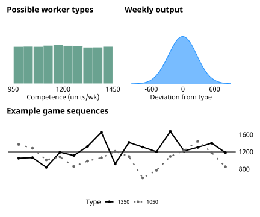
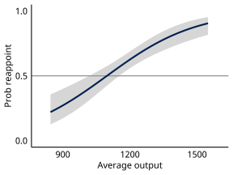
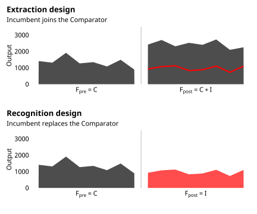
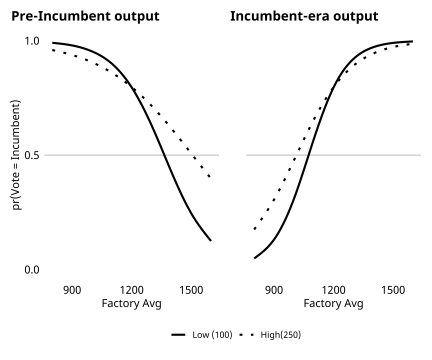

```{r setup, include=FALSE}
  options(htmltools.dir.version = FALSE)
  knitr::opts_chunk$set(
    message = F, 
    warning = F, 
    eval = T, 
    echo = F, 
    fig.align = 'center', 
    dev = 'svglite', 
    dpi = 400
  )
  
  library(tidyverse)
  library(knitr)
```


# Research and Acknowledgements 
  

.pull-left-narrow[
  .center[]
]

.pull-right-wide[
Research presented here published in:  

- *Quality Control* (2023), Cambridge University Press

- "Unmasking Competence" (2022) *Journal of Politics*
]


.pull-left-narrow[
  .center[ ]
]

.pull-right-wide[
  **Austin Hart**, ahart@american.edu  
  Associate Prof of Politics, Governance, and Economics  
  American University
]

.pull-left-narrow[
  .center[ ]
]

.pull-right-wide[
  **J. Scott Matthews**, scott.matthews@mun.ca  
  Professor of Political Science  
  Memorial University
]

---
# Summary of contributions

.pull-left[
### Integration/Appraisal framework
- Theoretical & empirical lens for studying retrospective voting
- 11 experiments allowing I/A to unfold  
- Findings:  
  - Quite capable I/A  
  - Benchmark processing
]

.pull-right[
### Case for 'synthetic' experiments
- Rethinking realism and external validity
- Impact\-estimating vs Theory\-testing
- Criteria for external validity for experiments that test theory
]

---
# Retrospective voting (RV)

> Voters hold govts accountable for their performance in office.
> They reward good outcomes and sanction poor outcomes. (Fiorina 1981)

- Widespread evidence of RV  
  - Ubiquitous if variable (Healy & Malhotra 2009)
  - Causal arrow from attitude to vote (e.g., Lenz 2012, Hart & Middleton 2015)  
  
- Normative ambiguity (Achen & Bartels 2016)  
  - Myopic judgments (Healy & Lenz 2014)
  - Cannot parse competence from luck (Huber et al. 2012) 

---
# Unexplored microfoundations  
### Can subjects differentiate competent from incompetent incumbents?  

- Retrospective voting *requires*
  - **Integration** over stream of performance info
  - **Appraisal** of impression
  
- But I/A largely unseen
  - Uncommon focus of theory
  - Obs & Exp limitations


---
# Past experiments short-circuit I/A

&nbsp;
<blockquote>
Experts say that not only have economic conditions deteriorated a lot over the last year, but the British economy is doing considerably worse that most other countries.
.right[-- Tilly & Hobolt, 2011]
</blockquote>

- Vignette provides 
  - pre\-integrated summary
  - explicit appraisal cue  
  
- Have yet to study I/A in controlled setting


---
# Experimental framework

.pull-left-1[

- Monitor new worker
- Vote to reappoint/replace
- Bonus $\propto$ factory output
- Worker is fully\-trained but 
  - Type unknown, <br> $\mu_{inc} \sim U(950,1450)$
  - Output variable, <br> $Y_{inc,t} \sim N(\mu_{inc},250^2)$  

]

.pull-right2[
&nbsp; 
.center[]
]


---
class: sydney-blue

# Capacity and bias in I/A

&nbsp;

### Exp 1: Can voters identify competence in variable stream?
### Exp 2: Preference for stable performers?
### Exp 3: Over-punish negative outcomes?
### Exp 4: Judging performance myopically?


---
# Exp 1. Baseline performance vote

### Given variable stream, can subjects identify competence? 

.pull-left-1[
- N = 248

- Key design elements
  - $\mu_{inc} \sim U(950,1450)$
  - Output $Y_{inc,t} \sim N(\mu_{inc},250^2)$

- Findings
  - Subjects manage I/A
  - Demonstrate rules comp
  - Not 'blindly retro'
]

.pull-right-2[

```{r fig3, out.width = '550px'}
  
```
]


---
class: sydney-blue

# Confronting spillover in I/A

&nbsp;

### Exp 5: Extract competence from confounded stream?
### Exp 6: Recognize relevant (ignore irrelevant) info?
### Exp 7: Complex confounding  
### Exps 8-9: Info search and provision 
### Exps 10-11: Benchmark quality and complexity


---
# Strategies for managing spillover

- Blind retrospection (Achen & Bartels 2016)  
  - No accounting for spillover
  - RV as myopic, indiscriminant displacement

- Rational discounting (Duch & Stevenson 2008) 
  - Voters discount by variance of spillover
  - RV as sophisticated signal extraction
  
- Benchmark comparison (Kayser & Peress 2012)  
  - Competence in relative performance gap
  - RV as low-info "social comparison" 

---
# Multiworker designs
### Can voters differentiate competence from luck? 

.pull-left-1[
### Game Flow
1. Comparator begins
2. Monitor factory output, $F_{pre}$
3. Incumbent arrives in week 9
4. Monitor factory output, $F_{post}$
5. Vote on reappointment
]

.pull-right-2[
```{r multiflow, out.width = '550px'}
  
```
]


---
# Exp 5. Extracting competence

### Can subjects extract competencce from confounded stream? How?

.pull-left-1[
- N = 819  

- Key design elements
  - Randomize type\output
  - Variance treatment $\sigma_{comp} \in (100,250)$
  
- Findings
  - Capable signal extraction
  - Benchmark processing
]

.pull-right-2[
```{r study5, out.width = '550px'}
  
```
]


---
# Consistent benchmark response
### Estimates of I/A under interdependence

$$logit(Reappoint_i = 1) = \alpha F_{pre,i} + \beta F_{post,i} + \theta + u_i$$


| Study |	Design (n)  | $\hat{\alpha}$ | $Pr(\alpha \geq 0)$  | $\hat{\beta}$ | $Pr(\beta \leq 0)$ |
|-------|:------------|----------|--------|---------|---------|
| 5	| Extraction (849)       |	-0.59 |	< 0.001 |	0.86	| < 0.001 |
| 6	| Recognition (368)     |	-1.12 |	< 0.001 |	1.56	| < 0.001 |
| 7	| Extraction (550)       |	-0.62 |	< 0.001	| 0.87	| < 0.001 |
| 8	| Extraction arm (473)   |	-0.49 |	< 0.001 |	0.68	| < 0.001 |
|	  | Recognition arm (247) |	-0.47 |	< 0.001 |	1.03	| < 0.001 |
| 9	| Extraction arm (894)	  | -0.26 |	< 0.001	| 0.54	| < 0.001 |
| 	| Recognition arm (482) |	-0.28 |	< 0.001 |	0.90	| < 0.001 |
| 11 |	Dual stream (920)   |	-0.80 |	< 0.001	| 0.57	| < 0.001 |


---
class: sydney-blue

# External validity and experimental design

&nbsp;

### RCT as "standard" 

### Impact-estimating vs Theory-testing inquiry

### Evaluating "synthetic" designs for theory testing


---
# Synthetic experiments and generalization

&nbsp;

> If we want to learn about political behavior, shouldn't our design be more *realistic*?

&nbsp;

.center[.large[No.]]


---
# Rethinking generalizability

- The RCT sets the standard  
  - Eliminate lab--field distinction (Green & Gerber 2003)  
  - Generalize from lab conditional on realism (Findley et al. 2021)  

- Generalization beyond local impact
  - Populations, Treatments, Outcomes, Contexts (Egami & Hartman 2023)
  - Uncovering general tendencies
  - Testing/advancing theory
  
- Parallelism of experiment...
  - cannot establish external validity
  - may limit, rather than strictly enhance, external validity
  


---
# Intent and design

- Exp should mimic the target of generalization  

&nbsp;

|                       | Impact-estimating | Theory-testing    |
|:----------------------|:------------------|:------------------|
| Generalize to what?   | Impact/ATE        | Model             |
| Nature of target      | Complex           | Minimalist        |
|                       | Context-bound     | "Universal"       |
| Design to match       | Realistic         | Synthetic         | 
|                       | Specific          | Abstract          |
| Limitations           | Local             | Thin              |


---
# Criteria for external validity

### in 'synthetic' experiments for testing theory

- Setup
  - Identify theory testing as central goal
  - Ground generalization in theory
  - Specify models & *a priori* propositions under study  

- Design
  - Exp "world" captures only essential essence of the models
  - Creates space for contested behaviors to emerge
  - Experimental realism


---
class: sydney-blue

# Quality Control and psychology of retrospection 
  
- *Can* voters hold governments accountable? **YES**
  - Capacity well beyond blind retrospection
  - Strategic, imperfect benchmarking 

- *Do* voters hold governments accountable? **maybe...**
  - Update models to reflect capacity 
  - Consider why it might/might not appear in practice

- Next steps  
  - Appraise first, integrate later
  - Locating negativity bias
